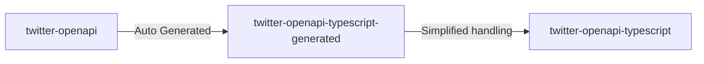

# twitter-openapi-typescript

[issues](https://github.com/fa0311/twitter-openapi-typescript/issues) / [discussions](https://github.com/fa0311/twitter-openapi/discussions)

## Table of Contents

This repository contains two packages.

- [twitter-openapi-typescript](./twitter-openapi-typescript) Package for human-friendly TypeScript
- [twitter-openapi-typescript-generated](./twitter-openapi-typescript-generated) TypeScript package automatically generated from [twitter-openapi](https://github.com/fa0311/twitter-openapi) by OpenAPI generator

---

## twitter-openapi-typescript

Learn more about people-friendly TypeScript packages here.

[twitter-openapi-typescript/README.md](./twitter-openapi-typescript/README.md)

## twitter-openapi-typescript-generated

Learn more about the automatically generated TypeScript package here.

[README-generated.md](./README-generated.md)

## License

This project is dual licensed. You can choose one of the following licenses:

- [Custom License](./LICENSE)
- [GNU Affero General Public License v3.0](./LICENSE.AGPL)
