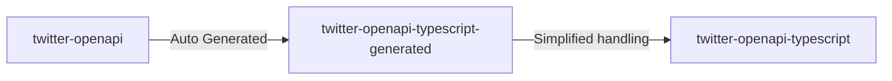

# twitter-openapi-typescript

[issues](https://github.com/fa0311/twitter-openapi-typescript/issues) / [discussion](https://github.com/fa0311/twitter-openapi/discussions)

## Table of Contents

This repository contains two packages.

- [twitter-openapi-typescript](./twitter-openapi-typescript) Package for human-friendly TypeScript
- [twitter-openapi-typescript-generated](./twitter-openapi-typescript-generated) TypeScript package automatically generated from [twitter-openapi](https://github.com/fa0311/twitter-openapi) by OpenAPI generator



---

## twitter-openapi-typescript

Learn more about people-friendly TypeScript packages here.

[twitter-openapi-typescript/README.md](./twitter-openapi-typescript/README.md)

## twitter-openapi-typescript-generated

> Note! twitter-openapi-typescript-generated is a package for advanced users who are familiar with Twitter's API. In general, [twitter-openapi-typescript](./twitter-openapi-typescript) should be used!

Build

```shell
git clone https://github.com/fa0311/twitter-openapi-typescript.git
cd twitter-openapi-typescript-generated
```

```shell
openapi-generator-cli version # 6.5.0
```

```shell
java -jar tools/openapi-generator-cli.jar generate -g typescript-fetch -c tools/openapi-generator-config.yaml
npm run build
```

Setup

```shell
npm twitter-openapi-typescript-generated
```

License

This project is dual licensed. You can choose one of the following licenses:

- [Custom License](./LICENSE)
- [GNU Affero General Public License v3.0](./LICENSE.AGPL)

Usage

[twitter-openapi-typescript-generated/README.md](./twitter-openapi-typescript-generated/README.md)
