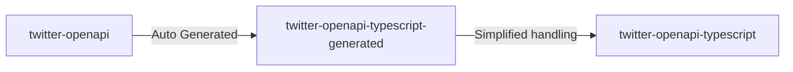

# twitter-openapi-typescript

## Table of Contents

- [twitter-openapi-typescript](./twitter-openapi-typescript) Package for human-friendly Dart
- [twitter-openapi-typescript-generated](./twitter-openapi-typescript-generated) Dart package automatically generated from [twitter-openapi](https://github.com/fa0311/twitter-openapi) by OpenAPI generator



## twitter-openapi-typescript

[twitter-openapi-typescript/README.md](./twitter-openapi-typescript/README.md)

## twitter-openapi-typescript-generated

> Note! twitter-openapi-typescript-generated is a package for advanced users who are familiar with Twitter's API. In general, [twitter-openapi-typescript](./twitter-openapi-typescript) should be used!

### Build

```shell
git clone https://github.com/fa0311/twitter-openapi-typescript.git
cd twitter-openapi-typescript-generated
```

```shell
openapi-generator-cli version # 6.5.0
```

```shell
java -jar tools/openapi-generator-cli.jar generate -g typescript-fetch -c tools/openapi-generator-config.yaml
npm run build
```

### Setup

It cannot be installed from npm.  
Plan to release it in v1.0.0 with npm.  
Recommend adding the latest commit hash after #ref as many destructive changes are made.

```shell
git clone https://github.com/fa0311/twitter-openapi-typescript
npm install twitter-openapi-typescript/twitter-openapi-typescript
```

### Usage

[twitter-openapi-typescript-generated/README.md](./twitter-openapi-typescript-generated/README.md)
